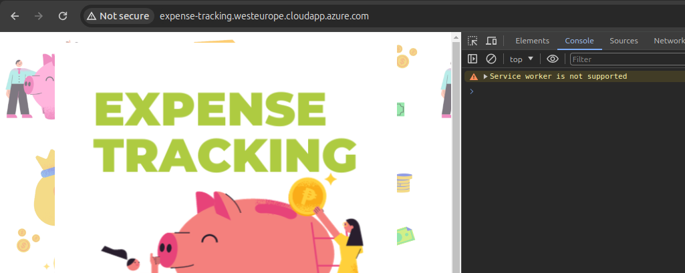
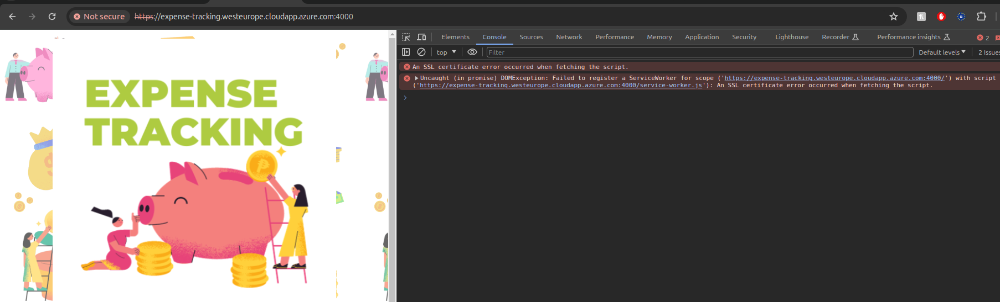

# Deployment to Microsoft Azure Virtual Machine

## 1. Set up Microsoft Azure Virtual Machine 

https://learn.microsoft.com/en-us/azure-stack/user/azure-stack-dev-start-howto-vm-nodejs?view=azs-2306

### Create a VM

1. Set up your VM in Azure Stack Hub by following the instructions in [Deploy a Linux VM to host a web app in Azure Stack Hub](https://learn.microsoft.com/en-us/azure-stack/user/azure-stack-dev-start-howto-deploy-linux?view=azs-2306).

2. In the VM network pane, make sure that the following ports are accessible:

    Port| Protocol| Description
    :--:| :--:| :--
    80| HTTP| Hypertext Transfer Protocol (HTTP) is the protocol that's used to deliver webpages from servers. Clients connect via HTTP with a DNS name or IP address.
    443| HTTPS| Hypertext Transfer Protocol Secure (HTTPS) is a secure version of HTTP that requires a security certificate and allows for the encrypted transmission of information.
    22| SSH| Secure Shell (SSH) is an encrypted network protocol for secure communications. You use this connection with an SSH client to configure the VM and deploy the app.
    3389| RDP| Optional. The Remote Desktop Protocol (RDP) allows a remote desktop connection to use a graphic user interface on your machine.
    3000| Custom| The port that's used by the Node.js Express framework. For a production server, you route your traffic through 80 and 443.

    **Note:** The custom port will be the one for the `expense-tracking-service`, the **80** and **443** will be for `expense-tracking-ui-server`

### Install Node

1. Connect to your VM by using your SSH client. 

    Open the terminal and enter the following command (where `username` is the username for the Linux machine and `ip` is the IP address for the Linux machine):

    ```bash
    ssh username@ip
    ```

    Then you will need to enter the password. 
    Alternately you can [connect via SSH with PuTTY](https://learn.microsoft.com/en-us/azure-stack/user/azure-stack-dev-start-howto-ssh-public-key?view=azs-2306#connect-with-ssh-by-using-putty).

2. At the bash prompt on your VM, enter the following command:

    ```bash
    sudo apt-get update
    sudo apt-get install nodejs
    sudo apt-get install npm
    ```
    This also installs NPM, a package manager for Node.js packages, or modules.

3. Validate your installation. While you're still connected to your VM in your SSH session, enter the following command:

    ```bash
    node --version
    ```


### Install [pm2](https://www.npmjs.com/package/pm2)
1. While you're still connected to your VM in your SSH session, enter the following command:

    ```bash
    sudo npm install pm2 -g
    ```

1. Validate your installation. While you're still connected to your VM in your SSH session, enter the following command:

    ```bash
    pm2 --version
    ```


----

## 2. Deploy

1. At the moment the project does not have a release/deploy script or GitHub Action. So, in order to have the project running in the Virtual Machine we will clone the project and install the dependencies.

    While you're still connected to your VM in your SSH session, enter the following commands:

    ```bash
    git clone https://github.com/rutesantos4/expense-tracking-clone

    cd expense-tracking-clone/expense-tracking-service
    npm i

    cd ../expense-tracking-ui
    sudo npm install tailwindcss
    sudo npm install @tailwindcss/forms
    sudo npm install tailwindcss-plugins
    sudo npx tailwindcss -i styles.css -o ./dist/output.css --minify

    cd ../expense-tracking-ui-server
    npm i

    cd ..

    ```

2. Also we need to create the .env files and add the configuration keys.
Check [expense-tracking-service setup file](./expense-tracking-service/setup.md) and [expense-tracking-ui-server README file](./expense-tracking-ui-server/README.md) to see list of configuration keys for each service.


----


## 3. SSL Certificate

In order for the Web notification to work we need to use HTTPS, and therefore, configure the SSL Certificates.




A self-signed certificate will also not work, when using a port different from **443**.



So we will use **Certbot** to generate the certificates.

1. First we need to install certbot

    ```bash
    sudo apt-get install certbot
    ```

2. The Certbot will verify the webserver by looking at the folder `/.well-known/acme-challenge`. For this we need to change the file `expense-tracking-ui-server/index.js`, by addind the following lines (and commenting the creation of servers). `HTTP_PORT` should be **80**:

    ```javascript
    app.use(express.static('.', {dotfiles:'allow'}));
    app.listen(process.env.HTTP_PORT, () => {
        console.log(`App listening on port ${process.env.HTTP_PORT}`);
    });
    ```

3. We need to start this server:

    ```bash
    sudo -s

    cd ../expense-tracking-ui-server
    pm2 --name expense-tracking-ui-server start npm -- start

    cd ..

    ```


4. Finally, generate the certificate by running the following command, under the root of the ui server:

    ```bash
    sudo certbot certonly --webroot -w . -d expense-tracking.westeurope.cloudapp.azure.com
    ```

    The result will be someting like:

    ```bash
    Successfully received certificate.
    Certificate is saved at: /etc/letsencrypt/live/expense-tracking.westeurope.cloudapp.azure.com/fullchain.pem
    Key is saved at:         /etc/letsencrypt/live/expense-tracking.westeurope.cloudapp.azure.com/privkey.pem
    ```

    This file locations should be set in the properties `KEY_FILE_PATH` and `CERTIFICATE_FILE_PATH` in the `expense-tracking-ui-server/.env` file and the properties `keyFilePath` and `certificateFilePath` in the `expense-tracking-service/.env` file.


5. Now we can stop the expense-tracking-ui-server and revert the changes

    ```bash
    pm2 delete $PROCESS_ID
    git restore index.js
    ```

----


## 4. Start services

1. At the bash prompt on your VM, enter the following command (using `sudo` because we will be using the ports **80** and **443**):

    ```bash
    sudo -s
    cd expense-tracking-service
    pm2 --name expense-tracking-service start npm -- start

    cd ..

    cd expense-tracking-ui-server
    pm2 --name expense-tracking-ui-server start npm -- start

    cd ..

    ```

2. To listen the running processes:

    ```bash
    pm2 ps
    ```

3. To stop a process:

    ```bash
    pm2 delete $PROCESS_ID
    ```

4. To check the logs:

    ```bash
    pm2 logs
    ```

